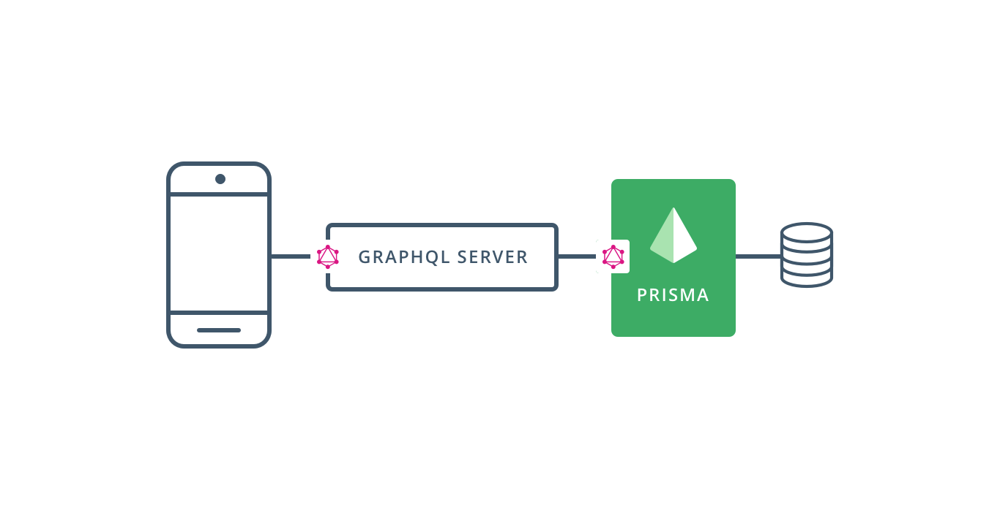

# Introducción

## ¿Que es Prisma?
Prisma nos ofrece _una capa de abstracción sobre la base de datos_, que nos facilita
la interacción de nuestro servidor GraphQL con la base de datos.



## GraphQL
### Esquemas: El centro de toda API GraphQL

Los esquemas definen todas las operaciones disponibles en nuestra API y sus tipos
de datos. Los esquemas se escriben utilizando una sintáxis específica llamada SDL
(Schema Definition Language).

En el siguiente ejemplo definimos mediante SDL el tipo `Usuario` con dos campos: `id`
y `nombre`.

```graphql
type User {
  id: ID!
  name: String!
}
```

Todos los esquemas GraphQL tienen tres tipos principales llamados _roots_, que
definen todas las operaciones que conforman nuestra API:

- Query (Peticiones)
- Mutation (Mutaciones)
- Subscription (Subscripciones).

Los campos dentro de los tipos roots se conocen como _campos roots_ y proporcionan
los puntos de entrada (entry-points) de la API. Esto implica que cualquier petición
o mutación enviada a la API debe estar definida previamente como un campo root.

```graphql
type Query {
  users: [User!]!
}

type Mutation {
  createUser(name: String!): User!
}
```


### Resolvers: Implementan la funcionalidad definida en el esquema

GraphQL tiene una clara separación entre la estructura y el comportamiento.
Mientras en el _esquema_ solo se describe la estructura de la API, la implementación
de esta funcionalidad se realiza en los _resolvers_.

Todos los campos roots de un esquema tienen su correspondiente función resolver.
Una función resolver siempre recibe cuatro parámetros:

1. `parent` (también conocido como root): Como las _queries_ pueden tener campos
anidados, y cada campo puede tener su propia función resolver, el parámetro `parent`
siempre representa el valor devuelto por el resolver previo.

2. `args`: Los posibles argumentos que recibirá un resolver definidos en el esquema-
3. `context`: Un objeto que sirve para que los resolvers se puedan comunicar y
compartir información.
4. `info`: Una representación AST de las peticiones o las mutaciones.

En el siguiente ejemplo se muestra la implementación de un resolver para la siguiente
definición de un esquema (en este ejemplo se pasa a través de el contexto de la
aplicación un objeto db, que proporciona una interfaz con la base de datos).

```graphql
#schema.graphql

type Query {
  users: [User!]!
}

type Mutation {
  createUser(name: String!): User!
}
```


```js
#resolvers.js

const Query = {
  users: (parent, args, context, info) => {
    return db.users()
  }
}

const Mutation = {
  createUser: (parent, args, context, info) => {
    return db.createUser(args.name)
  }
}
```

### Prisma y GraphQL

Como hemos visto anteriormente, el flujo de desarrollo cuando implementeamos un
servidor con GraphQL, consiste en la definición de un esquema y su posterior
desarrollo mediante resolvers. Esto se conoce como _desarrollo orientado a
esquemas_ (schema-driven development).

La parte más complicada de GraphQL es la implementación de los resolvers,
en ellos, necesitamos atacar alguna fuente de datos, ya sea una base de datos (SQL
o NoSQL), una API REST o cualquier otro servicio proporcionado por terceros.

Prisma nos ofrece una interfaz sencilla para atacar directamente a una base de
datos, de forma que podemos resolver muchas peticiones CRUD con una sola línea.
Esta interfaz se desarrolla mediante _GraphQL Binding_.

GraphQL Binding puede compararse con un ORM tradicional.

## Arquitecutra de una aplicación con Prisma

Cuando construimos una aplicación GraphQL con Prisma, estamos separando la lógica
en dos capas:

- Database layer: Se encarga de realizar las interaciones CRUD con la base de datos.
se configura en el archivo prisma.yml y se genera automaticamente con el CLI de
Prisma. Es nuestra interfaz con la base de datos. (Prisma)
- Aplication layer: Es la responsable de cualquier funcionalidad que no está
directamente relacionado con escribir o leer de la base de datos (como la lógica
de negocio, autenticación, permisos, integraciones con terceros, ...).
Es la responsable de definir el esquema e implementar los resolvers. (Apollo Server)

En el hipotético caso de que nuestra aplicación no necesite ningún tipo de lógica
y simplemente lea y escriba en la base de datos, podríamos contectar el frontend
directamente con la base de datos a través de la _Database Layer_, el problema
es que cualquiera que tenga acceso al endpoint de nuestro Prisma, podrá controlar
completamente la base de datos.

Es importante entender que Prisma no es una Base de Datos, Prisma es la Database
Layer o interfaz con la que gestionamos la Base de Datos.

La separación en capas es un concepto que ha tomado auge en los últimos años,
considerándose como una buena práctica, existen dos tipos de arquitecturas basadas
en capas:

- Capas horizontales: Donde todos los integrantes se encuentran al mismo nivel
y se comunican entre si, como en el caso de los microservicios.

- Capas verticales: Como con el flujo de datos, los cuales van pasando de una capa
a otra de forma secuencial: Base de Datos, ORM o cualquier capa de acceso a los
datos, pasarelas API, varios tipos de webserver, ...

El concepto contrario a la separación de capas son las arquitecturas monolíticas,
donde toda la funcionalidad se une en un solo sitio, dificultando su mantienmiento
y desarrollo. En la arquitectura basada en capas, cada capa es independiente del
resto, lo que permite un desarrollo más flexible y fácil de mantener.

### Ejemplo real
Para entender mejor la arquitectura, veamos un ejemplo real donde queremos realizar
un Blog.

##### Aplication Layer
La capa Aplication es la que desarrollamos nosotros y se implementa mediante la
librería (Apollo)[] si estas utilizando Node.js. Comenzariamos definiendo nuestro
API mediante el esquema.

```graphql
# Schema
type Post {
  id: ID!
  title: String!
  published: Boolean!
}

type Query {
  feed: [Post!]!
  post(id: ID!): Post
}

type Mutation {
  createDraft(title: String!): Post!
  publish(id: ID!): Post
  deletePost(id: ID!): Post
}
```

Una vez hemos definido el esquema, debemos desarrollar los resolvers, como hay
cinco _campos root_, hay que definir cinco resolvers.

Normalmente en estos resolvers atacaríamos directamente a la base de datos,
teniendo que escribir las SQL queries o usar cualquier otra API de base de datos.
Gracias a Prisma, nos abstraemos de la tecnología utilizada en la base de datos y
el desarrollo de los resolvers se vuelve bastante sencillo.


```graphql
# Resolvers

const resolvers = {
  Query: {
    feed: (parent, args, context, info) => {
      return context.db.query.posts({ where: { published: true } }, info)
    },
    post: (parent, args, context, info) => {
      return context.db.query.post({ where: { id: args.id } }, info)
    },
  },
  Mutation: {
    createDraft: (parent, args, context, info) => {
      return context.db.mutation.createPost(
        {
          data: {
            title: args.title,
            published: false,
          },
        },
        info,
      )
    },
    publish: (parent, args, context, info) => {
      return context.db.mutation.updatePost(
        {
          where: { id: args.id },
          data: { published: true },
        },
        info,
      )
    },
    deletePost: (parent, args, context, info) => {
      return context.db.mutation.deletePost({ where: { id: args.id } }, info)
    },
  },
}
```

Como vimos anteriormente, el tercer parámetro que pasamos a los resolvers cuando
los definimos es el objeto `context` que comparten todos los resolver. Cuando
utilizamos Prisma, al instanciar `GraphQLServer` establecemos su valor pasándole
el objeto db, que contiene la _capa database_.

```graphql
const server = new GraphQLServer({
  typeDefs: './schema.graphql', // reference to the application schema
  resolvers,                    // the resolver implementations from above
  context: req => ({
    ...req,
    db: new Prisma({
      typeDefs: prismaSchema,
      endpoint: prismaEndpoint,
      secret: prismaSecret,
    }),
  }),
})

server.start()
```

##### Database Layer
Hemos visto que la Application Layer, consiste en definir un esquema e implementar
sus resolvers. El desarrollo de los resolvers es bastante sencillo gracias a que
delegamos en Prisma la interacción con la base de datos (Database Layer).

Anteriormente vimos como enlazar ambas capas mediante la instanciación de un objeto
Prisma que pasamos a todos los resolvers mediante una variable de contexto.

Pero, ¿como desarrollamos el servidor Prisma que hace de Database Layer?

Todo servicio Prisma necesita dos ficheros:

* Un archivo de configuración llamado prisma.yml.
* Una definición del modelo de datos, normalmente guardada en un archivo datamodel.graphql.

Lo configuración mínima necesaria para generar una API Prisma, sería la siguiente:

```yaml
# La ruta de los archivos con nuestro modelo de datos
datamodel:
  - typeA.graphql
  - typeB.graphql

# URL HTTP de la API de Prisma
endpoint: http://localhost:4466/blog/development

# Contraseña para proteger la API de Prisma
secret: mysecret123
```

Tenga en cuenta, que aunque el archivo con nuestro modelos de datos utiliza SDL,
no es un esquema GraphQL propiamente dicho. No contiene ninguno de los _tipos root_
que vimos anteriormente (Query, Mutation, Subscription).

Unicamente contiene la definición de los tipos de datos. Este modelo de datos se
utilizará para generar de forma automática la API de prisma.

```graphql
# datamode.graphql
type Post {
  id: ID! @unique
  title: String!
  published: Boolean!
}
```

Unicamente con estos dos archivos, Prisma tiene todo lo necesario para generar
su API. El siguiente paso será ejecutar `prisma deploy`.

La API de Prisma ofrece operaciones CRUD, esto implica que ahora puede crear, leer,
actualizar y eliminar recursos de su base de datos.
